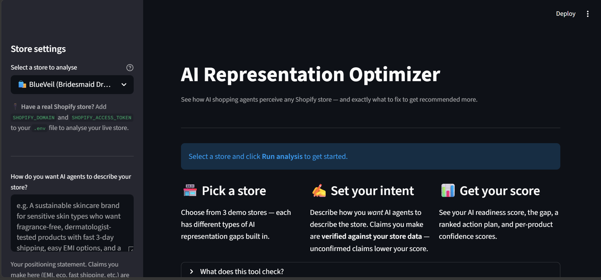
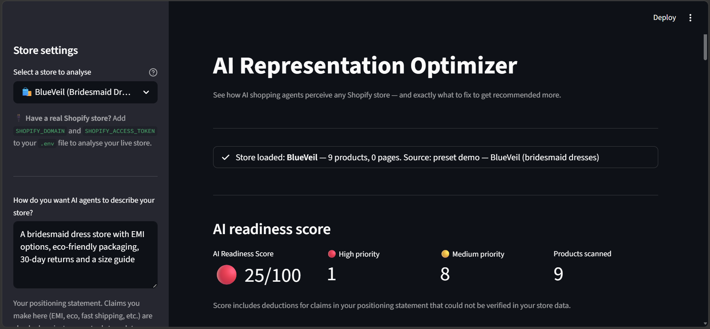
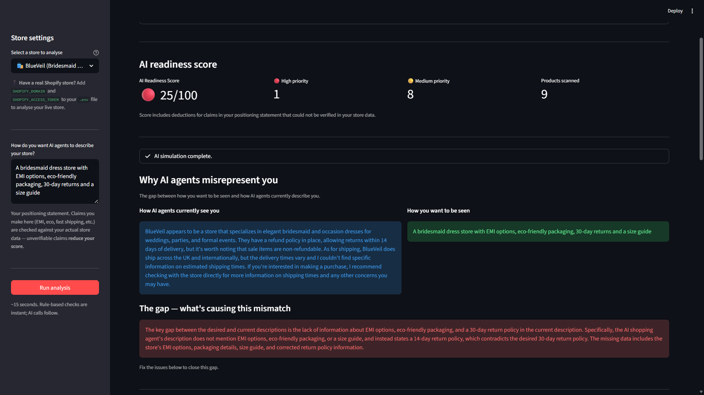
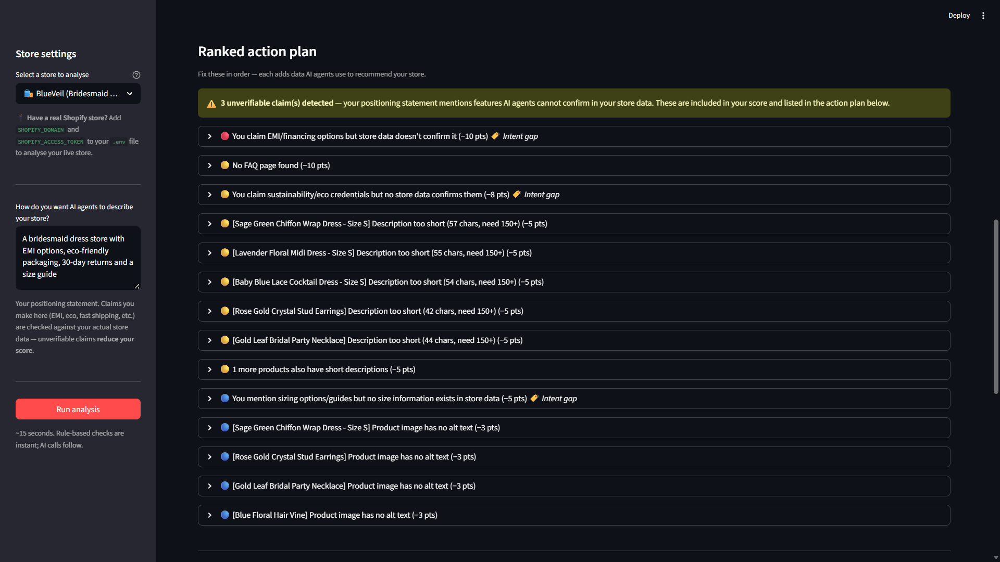
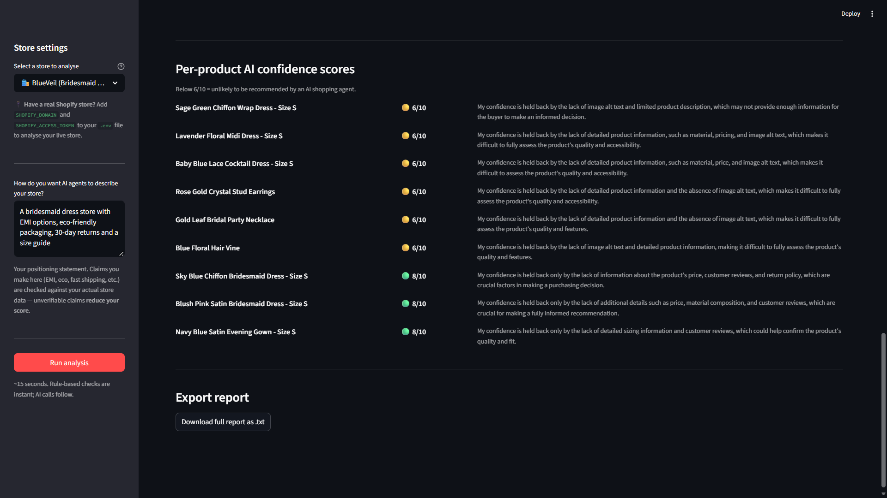

# AI Representation Optimizer
🚀 **[Live Demo](https://vibe-store-ai-optimizer.streamlit.app)**
**Kasparro Hackathon — Track 5 (Advanced): AI Representation Optimizer**

> A merchant-facing tool that shows Shopify store owners exactly why AI shopping agents misrepresent them — and what to fix, in priority order.

---

## The Problem

When a buyer asks an AI agent *"find me a bridesmaid dress store with good returns and fast shipping"*, the agent reads store data: product descriptions, policies, FAQ pages, image alt text. If that data is missing, vague, or contradictory, the AI skips the store or misrepresents it with caveats.

Most merchants don't know this is happening. This tool makes it visible and scored.

---

## What It Does

| Feature | Description |
|---|---|
| **AI readiness score** | 0–100 score with deductions tied to specific, fixable issues |
| **Gap analysis** | Compares how AI agents currently describe your store vs how you *want* to be described |
| **Intent vs reality** | Claims in your positioning statement checked against actual store data — unverifiable claims lower your score |
| **Ranked action plan** | Every issue framed as a lost sale, with a concrete fix template |
| **Per-product confidence** | How confidently would an AI agent recommend each product? (1–10) |
| **Downloadable report** | Full .txt export |

---

## How to Run

```bash
# 1. Install dependencies
pip install -r requirements.txt

# 2. Add your Groq API key (free at https://console.groq.com)
echo "GROQ_API_KEY=your_key_here" > .env

# 3. Run
streamlit run app.py
```

Opens at `http://localhost:8501`

---

## Run Tests

```bash
python -m pytest test_analyzer.py -v
```

13 tests covering scoring, intent-gap detection, word-boundary regression, and sort order.

---

## Architecture

```
store_data.py   ← Simulated Shopify stores (no live API needed for demo)
     ↓
analyzer.py     ← DETERMINISTIC: rule-based checks, zero AI calls
     ↓              Policies · Descriptions · FAQ · Contradictions · Intent gaps
ai_simulator.py ← AI LAYER: all Groq/Llama calls isolated here
     ↓              Perception · Gap analysis · Concurrent product scoring
app.py          ← Streamlit UI
config.py       ← All thresholds and scoring weights (single source of truth)
```

**AI/deterministic boundary:** `analyzer.py` has zero AI calls. The score is fully reproducible and testable without an API key.

---

## Files

| File | Purpose |
|---|---|
| `app.py` | Streamlit UI |
| `store_data.py` | Demo stores + live Shopify fetch |
| `analyzer.py` | Deterministic diagnostic engine |
| `ai_simulator.py` | Groq/Llama AI simulation |
| `config.py` | All thresholds and constants |
| `test_analyzer.py` | pytest test suite (13 tests) |
| `PRODUCT_DOCUMENT.md` | Product thinking, decisions, tradeoffs |
| `TECHNICAL_DOCUMENT.md` | Architecture, implementation, failure handling |
| `DECISIONS.md` | Running log of every build decision |

---

## Contribution Note

**Team of 2:** Aakanksha Priya & Astha Pradhan

This was a joint effort across all areas — both members contributed to product thinking, 
engineering, and documentation throughout the build period.

- Product research, problem framing, and scope decisions were made together
- Architecture design and scoring logic were designed collaboratively
- Code was written, reviewed, and tested by both members
- Documentation reflects shared thinking across the entire project

AI tools (Claude) used for pair programming and debugging — all decisions, tradeoffs, 
and reasoning are our own, documented in `DECISIONS.md` and `PRODUCT_DOCUMENT.md`.

## Environment Variables

| Variable | Required | Purpose |
|---|---|---|
| `GROQ_API_KEY` | **Yes** | Groq API key for LLM calls (free tier at console.groq.com) |
| `STORE_NAME` | No | Override store name in reports |
| `STORE_DESCRIPTION` | No | Override store description in AI prompts |

---

## Known Limitations

- Demo uses simulated store data (see `store_data.py` for live Shopify swap-in instructions)
- Description quality check is length-based only (not prose quality)
- Intent gap detection uses keyword matching — won't catch paraphrased claims
- Groq free tier rate limits: max 5 concurrent product scoring calls

## Screenshots

### Home Screen


### AI Readiness Scores


### Gap Analysis



### Ranked Action Plan


### Per-Product Confidence Scores


